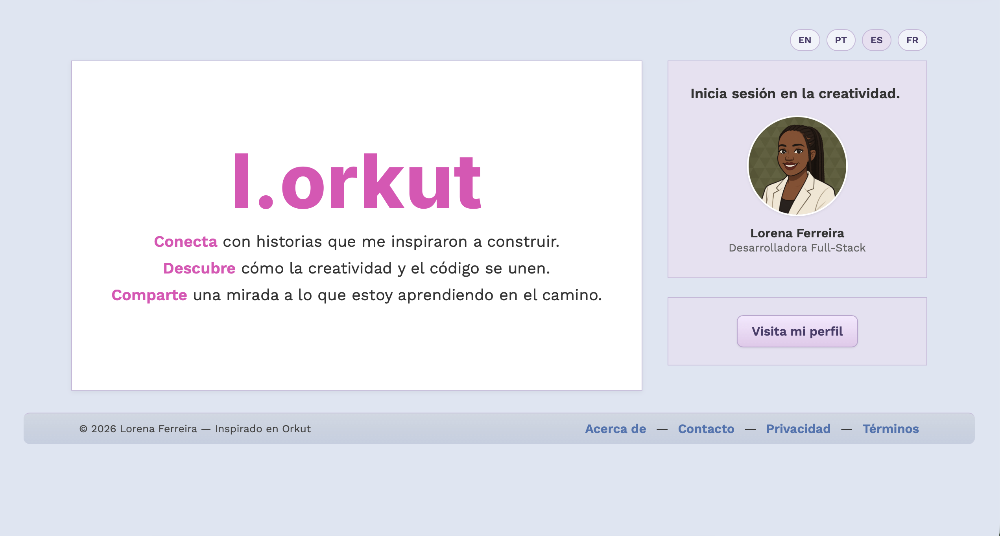
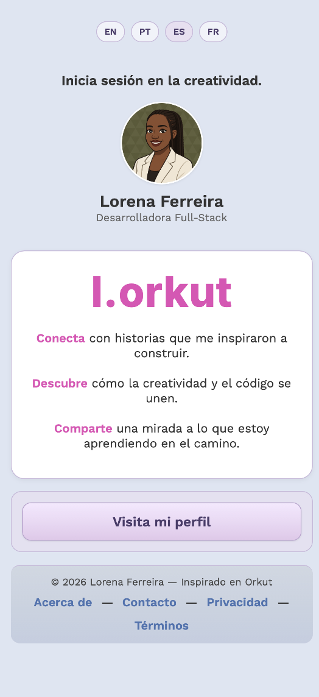
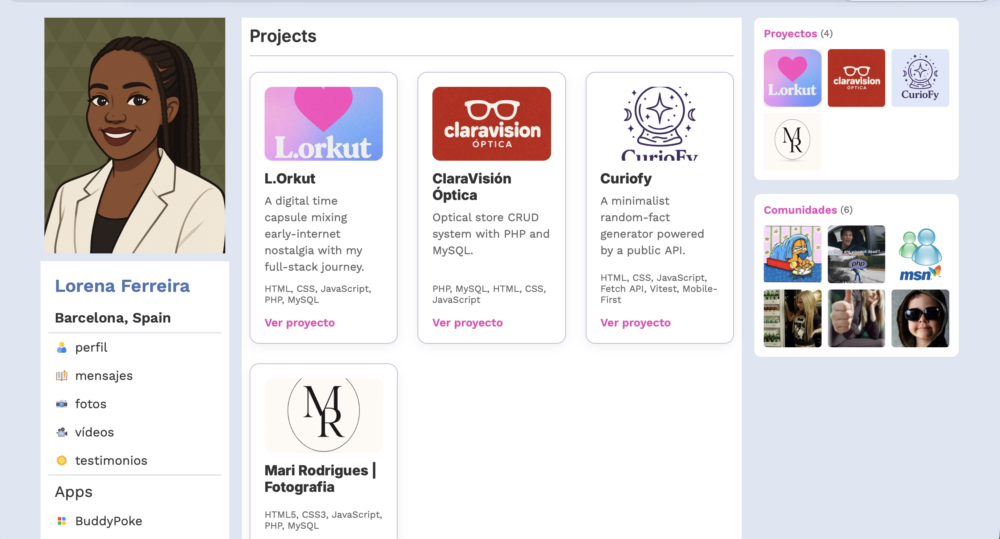
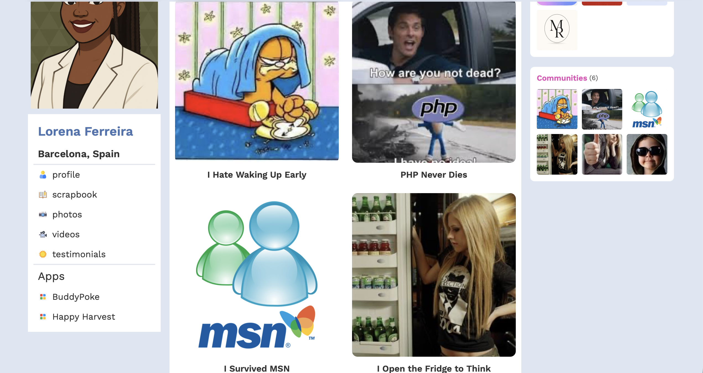

<h1 align="center">
  Lorena Ferreira | Full-Stack Developer Portfolio
</h1>

<p align="center">
  A modern full-stack portfolio showcasing my projects, professional experience, technical skills, and development journey.
</p>

<p align="center">

[](https://react.dev)
[](https://vite.dev)
[](https://developer.mozilla.org/en-US/docs/Web/JavaScript)
[](https://www.java.com)
[](https://spring.io/projects/spring-boot)
[](https://cloudinary.com)
[](https://railway.com)
[](https://vercel.com)
[](https://lorenaferreira.dev)

</p>

---

## Project Overview

This repository contains the latest version of my personal developer portfolio.

The project was built to present my work, experience, technical skills, and professional background through an interactive and responsive web experience.

Unlike a traditional static portfolio, this application includes a React frontend connected to a Spring Boot REST API, allowing project information and media to be managed through a scalable backend architecture.

The portfolio represents my transition from frontend development into full-stack development, combining modern interface design with backend services, cloud deployment, database integration, and media storage.

---

## Live Website

The application is available at:

### [lorenaferreira.dev](https://lorenaferreira.dev)

---

## Screenshots

> Add the screenshots to `docs/screenshots/` and update the filenames below when necessary.

### Desktop — Home



### Mobile — Home



### Projects



### Communities



---

## Main Features

* Responsive design for desktop, tablet, and mobile devices
* Interactive personal portfolio
* Dynamic project feed
* Full-stack frontend and backend integration
* REST API communication
* Project images hosted with Cloudinary
* Backend deployed on Railway
* Frontend deployed on Vercel
* Responsive project cards
* Professional experience timeline
* Technical skills presentation
* External project and repository links
* Contact and social media integration
* Reusable React components
* Environment-based configuration

---

## Tech Stack

### Frontend

* React
* Vite
* JavaScript
* JSX
* CSS3
* Fetch API

### Backend

* Java
* Spring Boot
* Spring Web
* Spring Data JPA
* REST API
* Maven

### Database

* PostgreSQL
* Railway-hosted database

### Media Storage

* Cloudinary

### Deployment

* Vercel — frontend
* Railway — backend and database

### Development Tools

* Git
* GitHub
* Visual Studio Code
* Postman
* Maven Wrapper

---

## Application Architecture

The portfolio follows a full-stack architecture with a clear separation between the frontend, backend, database, and media storage services.

```text
┌──────────────────────────────┐
│       React Frontend         │
│    Vite · JavaScript · CSS   │
│    Deployed on Vercel        │
└──────────────┬───────────────┘
               │
               │ HTTP Requests
               ▼
┌──────────────────────────────┐
│    Spring Boot REST API      │
│      Java · Spring Data      │
│     Deployed on Railway      │
└──────────────┬───────────────┘
               │
               │ JPA
               ▼
┌──────────────────────────────┐
│     PostgreSQL Database      │
│      Hosted on Railway       │
└──────────────────────────────┘

               │
               │ Image URLs
               ▼

┌──────────────────────────────┐
│      Cloudinary Storage      │
│     Project media hosting    │
└──────────────────────────────┘
```

The React application requests project information from the Spring Boot API. Project data is stored in PostgreSQL, while image files are hosted on Cloudinary and referenced through secure URLs.

---

## Project Structure

### Frontend

```text
src/
├── assets/
├── components/
├── pages/
├── services/
├── styles/
├── App.jsx
└── main.jsx
```

The frontend is organized into reusable components, page sections, service files, and dedicated styles.

### Backend

```text
src/main/java/
└── com/lorkut/backend/
    ├── controller/
    ├── model/
    ├── repository/
    ├── service/
    └── config/
```

The backend follows a layered architecture:

* **Controller:** exposes the REST API endpoints
* **Service:** contains application and business logic
* **Repository:** handles database communication
* **Model:** represents database entities
* **Config:** contains application configuration

---

## API Integration

The frontend retrieves project information from the Spring Boot backend through REST endpoints.

Example request:

```javascript
fetch(`${import.meta.env.VITE_API_URL}/api/feed`)
  .then((response) => {
    if (!response.ok) {
      throw new Error("Unable to load projects");
    }

    return response.json();
  })
  .then((data) => {
    console.log(data);
  })
  .catch((error) => {
    console.error(error);
  });
```

The production API URL is stored in an environment variable and is not hardcoded into the application.

```env
VITE_API_URL=https://your-backend-url.up.railway.app
```

---

## Running the Frontend Locally

### 1. Clone the repository

```bash
git clone https://github.com/lorenasferreira/lorenaferreira.dev.git
```

### 2. Open the project directory

```bash
cd lorenaferreira.dev
```

### 3. Install the dependencies

```bash
npm install
```

### 4. Create the environment file

Create a `.env` file in the project root:

```env
VITE_API_URL=http://localhost:8080
```

### 5. Start the development server

```bash
npm run dev
```

The frontend will normally be available at:

```text
http://localhost:5173
```

---

## Running the Backend Locally

The backend must be started separately from its own repository or project directory.

### Using Maven Wrapper

On macOS or Linux:

```bash
./mvnw spring-boot:run
```

On Windows:

```bash
mvnw.cmd spring-boot:run
```

The API will normally be available at:

```text
http://localhost:8080
```

Before starting the backend, configure the required database and Cloudinary environment variables.

Example:

```env
DATABASE_URL=your_database_url
DATABASE_USERNAME=your_database_username
DATABASE_PASSWORD=your_database_password

CLOUDINARY_CLOUD_NAME=your_cloud_name
CLOUDINARY_API_KEY=your_api_key
CLOUDINARY_API_SECRET=your_api_secret
```

Sensitive credentials must never be committed to the repository.

---

## Production Deployment

### Frontend — Vercel

The React application is connected to GitHub and automatically deployed through Vercel.

Every push to the production branch triggers a new deployment.

The frontend environment includes:

```env
VITE_API_URL=https://your-backend-url.up.railway.app
```

### Backend — Railway

The Spring Boot API is deployed on Railway.

Railway is responsible for:

* Building the Java application
* Running the Spring Boot server
* Managing backend environment variables
* Hosting the PostgreSQL database
* Providing the production API URL

### Images — Cloudinary

Cloudinary is used to host and deliver project images.

Instead of storing large image files directly in the database, the application stores Cloudinary URLs associated with each project.

This improves:

* Repository size
* Image delivery performance
* Media organization
* Future content management
* Deployment scalability

---

## Environment Variables

The project uses environment variables to protect credentials and separate local and production configurations.

Frontend:

```env
VITE_API_URL=
```

Backend:

```env
DATABASE_URL=
DATABASE_USERNAME=
DATABASE_PASSWORD=
CLOUDINARY_CLOUD_NAME=
CLOUDINARY_API_KEY=
CLOUDINARY_API_SECRET=
```

Environment files containing real credentials must be included in `.gitignore`.

---

## Code Quality

The project was developed with attention to:

* Reusable React components
* Clear separation of concerns
* Responsive-first development
* Organized project structure
* Secure environment configuration
* RESTful API design
* Layered Spring Boot architecture
* Maintainable CSS
* Descriptive variable and component names
* Scalable cloud-based infrastructure

---

## Challenges and Learnings

This project involved more than building the visual interface.

Some of the main technical challenges included:

* Migrating the portfolio to React
* Structuring reusable frontend components
* Building a Spring Boot REST API
* Connecting the frontend to a production backend
* Configuring CORS between Vercel and Railway
* Connecting Spring Boot to PostgreSQL
* Managing environment variables securely
* Deploying a Java backend to Railway
* Integrating Cloudinary for image hosting
* Handling production and local development configurations

These challenges helped strengthen my understanding of full-stack application development and cloud deployment.

---

## Future Improvements

* Authentication system
* Protected administration dashboard
* Project creation and editing interface
* Direct image uploads to Cloudinary
* Project deletion and visibility controls
* Contact form connected to the backend
* Improved loading and error states
* Automated tests
* Accessibility improvements
* Search engine optimization
* Performance monitoring
* Analytics integration
* Docker support
* Continuous integration workflow
* Content management features
* Blog or development journal

---

## Related Projects

### Marina Rodrii Photo

Photography portfolio developed with React and Vite.

* [Live Website](http://www.marinarodriiphoto.com/)
* [GitHub Repository](https://github.com/lorenasferreira/marinarodriiphoto)

### Au Pair na Espanha

Informational platform and digital project focused on helping au pairs understand the program in Spain.

* [Live Website](https://aupairnaespanha.com.br)
* [GitHub Repository](https://github.com/lorenasferreira/aupairnaespanha)

---

## Author

Designed and developed by **Lorena Ferreira**.

* Portfolio: [lorenaferreira.dev](https://lorenaferreira.dev)
* GitHub: [github.com/lorenasferreira](https://github.com/lorenasferreira)
* LinkedIn: [linkedin.com/in/lorenasferreira/](https://www.linkedin.com/in/lorenasferreira/)

---

<p align="center">
  Built with React, Spring Boot, PostgreSQL, Cloudinary, Vercel, and Railway.
</p>
